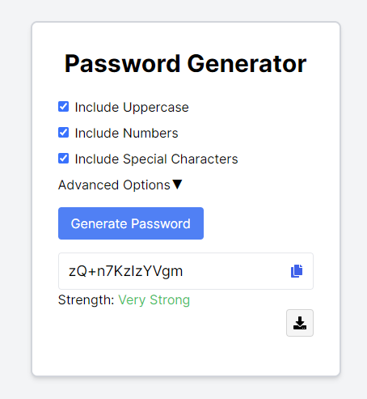

# Password Generator App

## Overview

This Password Generator App is a React-based project designed to help users generate strong and secure passwords based on a set of custom rules. With a sleek UI powered by Tailwind CSS, this app gives users the flexibility to generate passwords containing uppercases, numbers, and special characters. The generated password can be copied to the clipboard or downloaded as a text file.



## Features

- Generate a password based on user-selected options:
  - Include Uppercase
  - Include Numbers
  - Include Special Characters
  - Numbers Only
  - Letters Only
- Adjustable password length
- Password strength indicator
- Download generated password as a text file
- Copy the password to clipboard

## Tech Stack

- React
- NextJS
- Typescript
- Tailwind CSS
- React-icons (for the icon assets)

## Setup & Installation

Clone the repository

```bash
git clone https://github.com/your-username/password-generator-app.git

```

Navigate to the project directory

```bash
cd password-generator-app

```

Install dependencies

```bash
npm install

```

Run the app

```bash
npm npm start

```
